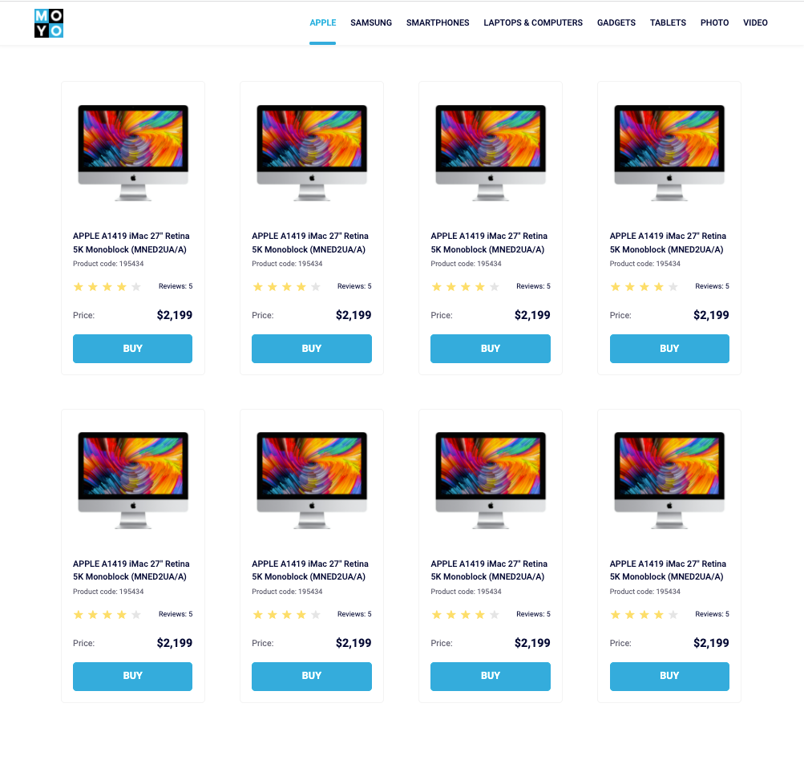

# Frontend catalog page
- [DEMO LINK](https://nazarbaraban.github.io/layout_catalog/)

Created an HTML page with a catalog following a provided mockup. Rewrote Card and Header blocks using BEM and SCSS. Ensured there are always 4 cards in a row using CSS selectors. Styled cards with fixed widths, maintained fixed distances between them, and added fixed paddings to the cards container. Used semantic HTML tags and added specific data-qa attributes for testing.

